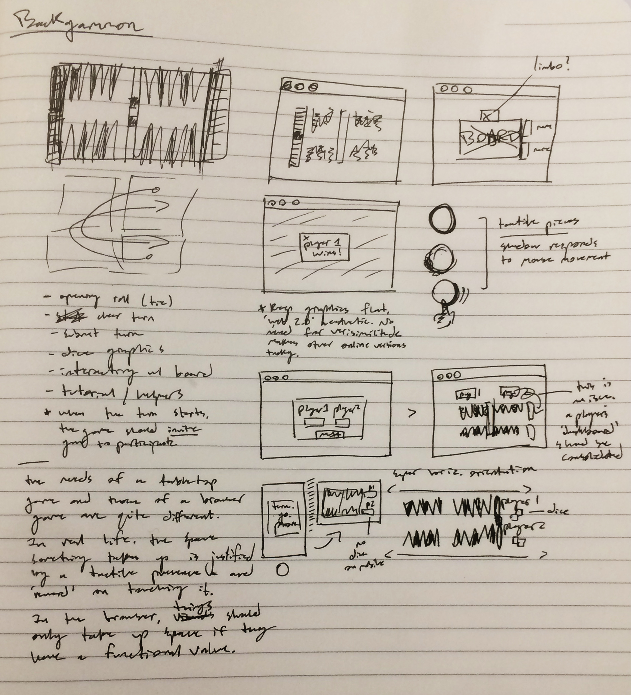
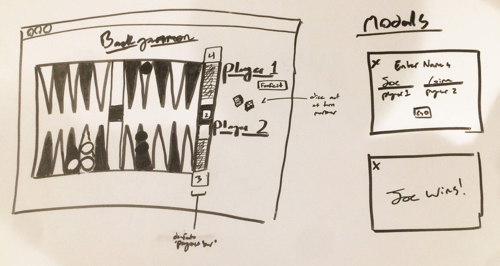
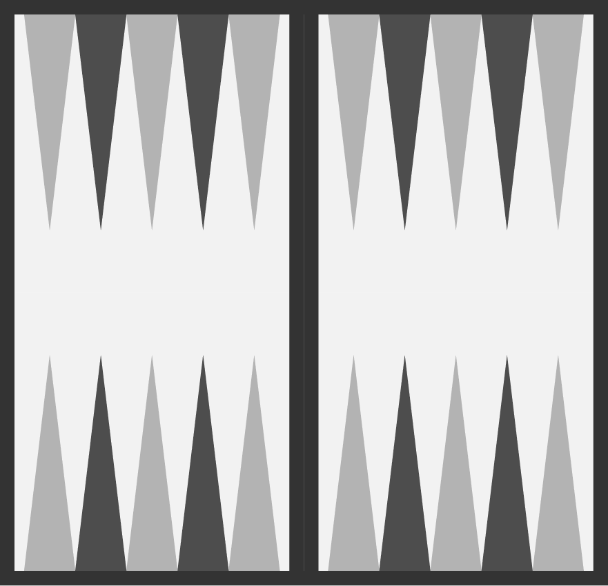

# Backgammon

## Approach

Backgammon is one of the oldest games around - and one of the most pleasingly complex and well-paced. It's turn-based and dice-driven, and there are plenty of web implementations available. I have noticed that most of them bend over backwards to evoke the literal textures of a backgammon board - leather, suede, etc. That doesn't make a lot of sense to me, because half the appeal of those materials is their tactile quality, which isn't present online. 

Beyond the aesthetic choice - representing  the board an pieces as simply and flatly as possible - this also means leveraging the dynamic quality of a web page. Information like: pieces left on the board, possible moves, best moves, etc. can all be represented visually and impermanently.

Time permitting, I also want to implement a very clean, responsive, two-machine functionality using firebase - i.e. two people on two computers can play backgammon. The best version of that has the immediate resposiveness of a game like [this](https://tictactoekate.firebaseapp.com/).

[More about backgammon](https://en.wikipedia.org/wiki/Backgammon).

## Minimum Viable Product

My MVP is a game of backgammon two players can play on one machine. Pleasing CSS and responsiveness aside, it simply needs to take the players through a game - letting them click to make moves, and obeying the rules of the game. Pieces will change position to reflect the state of the game, and an alert will fire when a player wins the game.

## Tecnologies To Be Used

Beyond the standard web technologies (`HTML`,`CSS`,and `JavaScript`), I will also be making use of the `jQuery` library.

If I make it to my strech goals, I will use `Firebase` as a simple database solution, and `angular.js` to ennable a smooth game without page reloads.

## Process 

* [Trello](https://trello.com/b/TF5bGnYn/backgammon)
* [Game in progress](https://gnordhielm.github.io/backgammon/)

